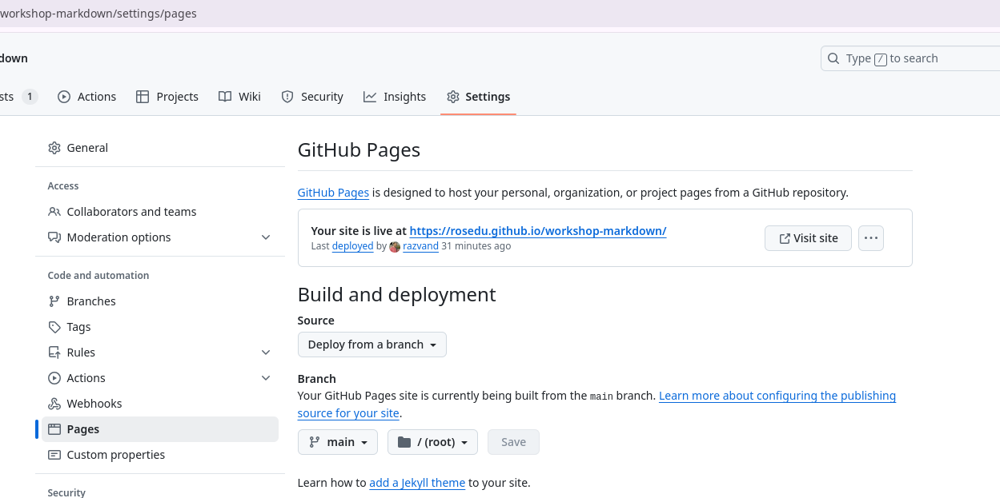

# Markdown Workshop

This is a practical workshop about the syntax and the use of the [Markdown format](https://www.markdownguide.org/basic-syntax/).
In particular, we will focus on the [GitHub Flavored Markdown](https://docs.github.com/en/get-started/writing-on-github/getting-started-with-writing-and-formatting-on-github/basic-writing-and-formatting-syntax), used by GitHub.
See the full specification of the GitHub Flavored Markdown [here](https://github.github.com/gfm/).

> [!NOTE]
> Markdown is not only used in GitHub / GitLab and other software development platforms, but also in chat message engines such as [Discord](https://discord.com/), note taking apps such as [HackMD](https://hackmd.io/) and wiki engines such as [MDwiki](https://mdwiki.info).
> Parts of the Markdown syntax are also used on WhatsApp, MS Teams and other chat message engines, particularly for text formatting.

## Set Up

To set up the workshop environment, follow the steps:

1. First of all, fork [this repository](https://github.com/rosedu/workshop-markdown).
   Use the `Fork` button on the top right of the repository page.

1. Create a local clone of your fork:

   ```console
   git clone git@github.com:<your-github-username>/workshop-markdown
   cd workshop-markdown/
   ```

   Make sure you have a [public SSH key configured](https://docs.github.com/en/authentication/connecting-to-github-with-ssh/adding-a-new-ssh-key-to-your-github-account) for your GitHub account, in order to clone the repository.
   Replace the `<your-github-username>` string above with your username on GitHub.

1. Add the `upstream` remote to point to the [upstream repository](https://github.com/rosedu/workshop-markdown):

   ```console
   git remote add upstream https://github.com/rosedu/workshop-markdown
   git fetch upstream
   ```

And let's get going! 🚀

## Markdown Use in Public Repositories

Let's start with checking how Markdown is being used in public repositories.

### This Repository

First, see this `README.md` file:

```console
cat README.md
```

You could also edit it using your preferred editor (Vim, Emacs, Nano, VS Code, Sublime) to also have syntax highlighting.

Also check the [`README.github.md` file](#README.github.md), a direct copy of the [`README.md` file in the `workshop-github` repository](https://github.com/rosedu/workshop-github).
To see the actual contents of a file on GitHub (such as the [`README.md` file in the `workshop-github` repository](https://github.com/rosedu/workshop-github)), click the `Raw` button in the top-right corner.
You'll get to [this page](https://raw.githubusercontent.com/rosedu/workshop-github/refs/heads/main/README.md) in raw format.

Identify syntax aspects in the documentation for [GitHub Flavored Markdown](https://docs.github.com/en/get-started/writing-on-github/getting-started-with-writing-and-formatting-on-github/basic-writing-and-formatting-syntax).
See:

- The use of `#`, `##`, `###` for section headings.
- The use of backticks for typewriter font, used for the names of files, functions, and 
- The use `-` and `\*` for unordered lists.
- The use of `1.` for ordered lists.
- The syntax used for links.
- The use of triple backticks for code snippets.
- And many others.

See how the Markdown syntax is rendered on GitHub for [this `README.md` file](https://github.com/rosedu/workshop-markdown/blob/main/README.md) and [the `README.github.md` file](https://github.com/rosedu/workshop-markdown/blob/main/README.github.md).

### Operating Systems (from Open Education Hub)

See Markdown files in the [Operating Systems (Open Education Hub / `cs-pub-ro`) repository](https://github.com/cs-pub-ro/operating-systems).
For files in the repository, check the raw format.
And check how they are rendered on [the website](https://cs-pub-ro.github.io/operating-systems/).

### Unikraft Docs

See Markdown files in the [Unikraft Docs repository](https://github.com/unikraft/docs).
For files in the repository, check the raw format.
And check how they are rendered on [the website](https://unikraft.org/)

### OWASP Website

See Markdown files in the [`owasp.github.io` repository](https://github.com/OWASP/owasp.github.io).
For files in the repository, check the raw format.
And check how they are rendered on [the website](https://owasp.org/).

## Using the Repository Fork

The [upstream repository](https://github.com/rosedu/workshop-markdown) already has branches numbered `cdl-00` to `cdl-99`.
The instructors will assign each of you a branch.

After the branch is assigned, create a local version of that branch locally:

```console
git branch <assigned-branch> upstream/<assigned-branch>
```

You will create pull requests **to** your assigned branch.

This means you will follow the steps:

1. Create a branch.
   Make sure you are on that branch.
1. Make changes.
1. Create commits.
1. Push changes to your fork.
1. Create a pull request from that push.
   The pull request must be target **to** your assigned branch (**not** the `main` branch).

## Fix a Markdown File

The [`dynamic-linking.ro.md` Markdown file](dynamic-linking.ro.md) has errors in it.
Fix these errors as part of a pull request.

Follow the instructions above to create the pull request.
Make sure you have good commit messages and a good pull request description.

Target the pull request **to** your assigned branch.

Ask the instructors to review your pull request.
Make updates as required.
Have your pull request approved and merged on top of your assigned branch.

Check the GitHub web view of the [upstream repository](https://github.com/rosedu/workshop-markdown) for your assigned branch.
Click on the button with `main` (the branch button) and select your branch.

Check the contents of the `dynamic-linking.ro.md` file and see if it is now rendered correctly.

### Clean Up After Pull Request

After the pull request is merged, clean up your work environment.
That is:

1. Go the pull request GitHub view and delete the remote branch.

1. Remove the reference to the remove branch in your clone:

   ```console
   git remote prune origin
   ```

1. Checkout the `main` branch:

   ```console
   git checkout main
   ```

1. Remove the local branch that you used for creating the pull request.
   It has the same name as the one you remote branch you removed above:

  ```console
  git branch -D <work-branch-used-for-PR>
  ```

1. Fetch the updates for your assigned branch.
   Your assigned branch is now updated after the pull request was merged:

   ```console
   git fetch upstream
   git checkout <your-assigned-branch>
   git rebase upstream/<your-assigned-branch>
   ```

1. Check the branch:

   ```console
   git log
   ```

## Create a Markdown File

The `helloworld-print.pdf` file is a PDF print of a GitHub view of a Markdown file.
Create the `helloworld.md` file that will generate that precise GitHub view.

> [!NOTE]
> The first large "Hello, World!" message is an image file: the file `helloworld.png` in the repository.

Make sure you do the following:

1. Start by creating a branch where you do your work.
   This will be the branch **from** where you will create a pull request.
   As usual, the future pull request will target your assigned branch in the [upstream repository](https://github.com/rosedu/workshop-markdown).

1. Copy-paste contents from the PDF file.
   Do not write programs by hand.

1. Use correct syntax items for typewriter format, links to sections, code snippet format, tables.
   See [the GitHub Markdown spec](https://github.github.com/gfm/).

1. Create and or update commits.
   Do periodic (force) pushes of the work branch:

   ```console
   git push --force origin <work-branch>
   ```

   After each push, check the GitHub view of the work branch in your fork of the GitHub repository.

1. After completing the task, submit the `helloworld.md` Markdown file as part of a pull request.

Follow the instructions above to create the pull request.
Make sure you have good commit messages and a good pull request description.

Target the pull request **to** your assigned branch.

Ask the instructors to review your pull request.
Make updates as required.
Have your pull request approved and merged on top of your assigned branch.

Check the GitHub web view of the [upstream repository](https://github.com/rosedu/workshop-markdown) for your assigned branch.
Click on the button with `main` (the branch button) and select your branch.

Check the contents of the `helloworld.md` file and see if it is now rendered correctly.

### Clean Up After Pull Request

After the pull request is merged, go to the same steps as above to clean your pull request.

## Your Turn

Add a Markdown file with contents of your own.
Use as many Markdown syntax features as possible.

Be sure to have at least:

- a link
- a code snippet
- a table
- an ordered list
- an unordered list
- headings
- an image
- an emoticon / emoji

Submit the Markdown file as part of a pull request.

Follow the instructions above to create the pull request.
Make sure you have good commit messages and a good pull request description.

Target the pull request **to** your assigned branch.

Ask the instructors to review your pull request.
Make updates as required.
Have your pull request approved and merged on top of your assigned branch.

Check the GitHub web view of the [upstream repository](https://github.com/rosedu/workshop-markdown) for your assigned branch.

### Clean Up After Pull Request

After the pull request is merged, go to the same steps as above to clean your pull request.

## GitHub Profile Page

GitHub provides you to option to have a GitHub profile page, that you can use as a form of open source CV / portfolio.
You can check the profile pages below as examples:

- [Andreia Ocănoaia](https://github.com/andreia-oca)
- [Gabi Mocanu](https://github.com/gabrielmocanu)
- [Cezar Crăciunoiu](https://github.com/craciunoiuc)
- [Maria Sfîrăială](https://github.com/mariasfiraiala)

The profile pages are rendered from a standard repository named **exactly** as the account name.
We will call this repository the **profile repository**.
See the contents of each account repository for the above accounts:

- https://github.com/andreia-oca/andreia-oca
- https://github.com/gabrielmocanu/gabrielmocanu
- https://github.com/craciunoiuc/craciunoiuc
- https://github.com/mariasfiraiala/mariasfiraiala

The repository consists of a single `README.md` Markdown file.
This `README.md` file in the profile repository is automatically rendered by GitHub on the account profile page.

Check the raw contents of `README.md` files above to see how the profile page is created.

### Create Your Own GitHub Profile Page

Create your own GitHub profile page.
Follow the steps:

1. Create your GitHub profile repository named **exactly** as your account name.
   Initialize it with a simple `README.md` file as instructed in the repository creation screen.

1. See the initial output of the repository on your GitHub page.

1. Clone the profile repository locally:

   ```console
   git clone git@github.com:<your-github-username>/<your-github-username>
   cd <your-github-username>
   ```

   Replace the `<your-github-username>` string above with your username on GitHub.

1. Update the `README.md` file in the repository with the contents you want for your profile.
   Take inspiration from the GitHub profile pages above.

1. Create commits with the updates to the `README.md` file.
   Push commits to the GitHub remote repository.
   Now check your resulting profile page on your GitHub page.

## Create a Website with GitHub and Markdown

We can use the contents of a GitHub repository, written with Markdown, to create a website.
This feature is called [GitHub Pages](https://docs.github.com/en/pages).

This is, for example, how the [Hardware-Software Interface website](https://cs-pub-ro.github.io/hardware-software-interface) is constructed, from the [corresponding `cs-pub-ro/hardware-software-interface` repository](https://github.com/cs-pub-ro/hardware-software-interface).
And the [Operating Systems website](https://cs-pub-ro.github.io/operating-systems/) also from the [corresponding `cs-pub-ro/operating-systems` repository](https://github.com/cs-pub-ro/operating-systems).

The content of this repository is published at: https://rosedu.github.io/workshop-markdown/
The main page of the website (https://rosedu.github.io/workshop-markdown/) is a rendering of `README.md`.

There are also renderings of the other pages:

- `README.github.md` is rendered at https://rosedu.github.io/workshop-markdown/README.github.html
- `dynamic-linking.ro.md` is rendered at https://rosedu.github.io/workshop-markdown/dynamic-linking.ro.html

To render these Markdown files as a website using GitHub Pages, we followed the instructions [here](https://docs.github.com/en/pages/getting-started-with-github-pages/creating-a-github-pages-site#creating-your-site).
The image below presents the configuration we did to configure GitHub Pages.



### Do It for Your Fork

Do the same configuration as above for your repository fork, at `https://github.com/<your-github-username>/workshop-markdown`.
Replace the `<your-github-username>` string above with your username on GitHub.

When configuring the repository in the `Settings` screen, the `Pages` option on your GitHub repository interface, use your own branch `cdl-..` as the publishing source.

If all is done correctly, you will be able to see the Markdown files rendered:

- `README.md` will be rendered at `https://<your-github-username>.github.io/workshop-markdown/`
- `README.github.md` will be rendered at `https://<your-github-username>.github.io/workshop-markdown/README.github.html`
- `dynamic-linking.ro.md` is rendered at `https://<your-github-username>.github.io/workshop-markdown/dynamic-linking.ro.html`
- `dynamic-linking.ro.md` is rendered at `https://<your-github-username>.github.io/workshop-markdown/helloworld.html`

### Create a Website from a Repository

Create a new separate repository on GitHub and create a website from it, adding content in Markdown.
Name it as you want and use content (in Markdown) as you want.
Make it personal, make it fun, use your imagination.

We recommend you use the `docs/` directory in the repository to store the website content.
Outside `docs/` you will have content not rendered.

Then configure the repository to be rendered using GitHub Pages.
See its contents at `https://<your-github-username>.github.io/<repository-name>/`.
