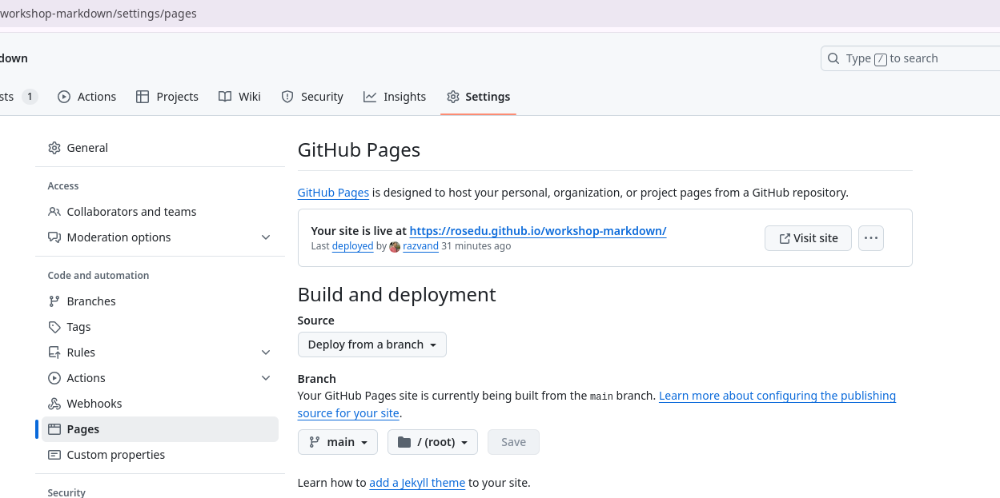

# Markdown and Makefile Workshop

This is a practical workshop about the syntax and the use of the [Markdown format](https://www.markdownguide.org/basic-syntax/) and of the [GNU make](https://www.gnu.org/software/make/manual/make.html) utility.
The Markdown part of this workshop will focus on the [GitHub Flavored Markdown](https://docs.github.com/en/get-started/writing-on-github/getting-started-with-writing-and-formatting-on-github/basic-writing-and-formatting-syntax) version, used by GitHub.
See the full specification of the GitHub Flavored Markdown [here](https://github.github.com/gfm/).

> [!NOTE]
> Markdown is not only used in GitHub / GitLab and other software development platforms, but also in chat message engines such as [Discord](https://discord.com/), note taking apps such as [HackMD](https://hackmd.io/) and wiki engines such as [MDwiki](https://mdwiki.info).
> Parts of the Markdown syntax are also used on WhatsApp, MS Teams and other chat message engines, particularly for text formatting.
> Makefiles are used to efficiently build and debug software in all types of projects, from message applications to hypervisors and operating system modules.
> What makes them so special is the ability to create a chain of command between different Makefiles, which has the wonderful effect of modularization.

## Set Up

To set up the workshop environment, follow the steps:

1. First of all, fork [this repository](https://github.com/rosedu/workshop-markdown).
   Use the `Fork` button on the top right of the repository page.

1. Create a local clone of your fork:

   ```console
   git clone git@github.com:<your-github-username>/workshop-markdown
   cd workshop-markdown/
   ```

   Make sure you have a [public SSH key configured](https://docs.github.com/en/authentication/connecting-to-github-with-ssh/adding-a-new-ssh-key-to-your-github-account) for your GitHub account, in order to clone the repository.
   Replace the `<your-github-username>` string above with your username on GitHub.

1. Add the `upstream` remote to point to the [upstream repository](https://github.com/rosedu/workshop-markdown):

   ```console
   git remote add upstream https://github.com/rosedu/workshop-markdown
   git fetch upstream
   ```

And let's get going! 🚀

## Markdown Use in Public Repositories

Let's start with checking how Markdown is being used in public repositories.

### This Repository

First, see this `README.md` file:

```console
cat README.md
```

You could also edit it using your preferred editor (Vim, Emacs, Nano, VS Code, Sublime) to also have syntax highlighting.

Also check the [`README.github.md` file](#README.github.md), a direct copy of the [`README.md` file in the `workshop-github` repository](https://github.com/rosedu/workshop-github).
To see the actual contents of a file on GitHub (such as the [`README.md` file in the `workshop-github` repository](https://github.com/rosedu/workshop-github)), click the `Raw` button in the top-right corner.
You'll get to [this page](https://raw.githubusercontent.com/rosedu/workshop-github/refs/heads/main/README.md) in raw format.

Identify syntax aspects in the documentation for [GitHub Flavored Markdown](https://docs.github.com/en/get-started/writing-on-github/getting-started-with-writing-and-formatting-on-github/basic-writing-and-formatting-syntax).
See:

- The use of `#`, `##`, `###` for section headings.
- The use of backticks for typewriter font, used for the names of files, functions, and
- The use `-` and `\*` for unordered lists.
- The use of `1.` for ordered lists.
- The syntax used for links.
- The use of triple backticks for code snippets.
- And many others.

See how the Markdown syntax is rendered on GitHub for [this `README.md` file](https://github.com/rosedu/workshop-markdown/blob/main/README.md) and [the `README.github.md` file](https://github.com/rosedu/workshop-markdown/blob/main/README.github.md).

### Operating Systems (from Open Education Hub)

See Markdown files in the [Operating Systems (Open Education Hub / `cs-pub-ro`) repository](https://github.com/cs-pub-ro/operating-systems).
For files in the repository, check the raw format.
And check how they are rendered on [the website](https://cs-pub-ro.github.io/operating-systems/).

### Unikraft Docs

See Markdown files in the [Unikraft Docs repository](https://github.com/unikraft/docs).
For files in the repository, check the raw format.
And check how they are rendered on [the website](https://unikraft.org/)

### OWASP Website

See Markdown files in the [`owasp.github.io` repository](https://github.com/OWASP/owasp.github.io).
For files in the repository, check the raw format.
And check how they are rendered on [the website](https://owasp.org/).

## Using the Repository Fork

The [upstream repository](https://github.com/rosedu/workshop-markdown) already has branches numbered `cdl-00` to `cdl-99`.
The instructors will assign each of you a branch.

After the branch is assigned, create a local version of that branch locally:

```console
git branch <assigned-branch> upstream/<assigned-branch>
```

You will create pull requests **to** your assigned branch.

This means you will follow the steps:

1. Create a branch.
   Make sure you are on that branch.
1. Make changes.
1. Create commits.
1. Push changes to your fork.
1. Create a pull request from that push.
   The pull request must be target **to** your assigned branch (**not** the `main` branch).

## Fix a Markdown File

The [`dynamic-linking.ro.md` Markdown file](dynamic-linking.ro.md) has errors in it.
Fix these errors as part of a pull request.

Follow the instructions above to create the pull request.
Make sure you have good commit messages and a good pull request description.

Target the pull request **to** your assigned branch.

Ask the instructors to review your pull request.
Make updates as required.
Have your pull request approved and merged on top of your assigned branch.

Check the GitHub web view of the [upstream repository](https://github.com/rosedu/workshop-markdown) for your assigned branch.
Click on the button with `main` (the branch button) and select your branch.

Check the contents of the `dynamic-linking.ro.md` file and see if it is now rendered correctly.

### Clean Up After Pull Request

After the pull request is merged, clean up your work environment.
That is:

1. Go the pull request GitHub view and delete the remote branch.

1. Remove the reference to the remove branch in your clone:

   ```console
   git remote prune origin
   ```

1. Checkout the `main` branch:

   ```console
   git checkout main
   ```

1. Remove the local branch that you used for creating the pull request.
   It has the same name as the one you remote branch you removed above:

  ```console
  git branch -D <work-branch-used-for-PR>
  ```

1. Fetch the updates for your assigned branch.
   Your assigned branch is now updated after the pull request was merged:

   ```console
   git fetch upstream
   git checkout <your-assigned-branch>
   git rebase upstream/<your-assigned-branch>
   ```

1. Check the branch:

   ```console
   git log
   ```

## Create a Markdown File

The `helloworld-print.pdf` file is a PDF print of a GitHub view of a Markdown file.
Create the `helloworld.md` file that will generate that precise GitHub view.

> [!NOTE]
> The first large "Hello, World!" message is an image file: the file `helloworld.png` in the repository.

Make sure you do the following:

1. Start by creating a branch where you do your work.
   Use `helloworld` for the branch name:

   ```console
   git checkout -b helloworld
   ```

   This will be the branch **from** where you will create a pull request.
   As usual, the future pull request will target your assigned branch in the [upstream repository](https://github.com/rosedu/workshop-markdown).

1. Copy-paste contents from the PDF file.
   Open the `helloworld-print.pdf` file in a PDF viewer, select text, copy in the `helloworld.md` file.

1. Use correct syntax items for typewriter format, links to sections, code snippet format, tables.
   See [the GitHub Markdown spec](https://github.github.com/gfm/).

1. Create and or update commits.
   Do periodic (force) pushes of the work branch:

   ```console
   git push --force origin <work-branch>
   ```

   After each push, check the GitHub view of the work branch in your fork of the GitHub repository.

   Check the contents of the `helloworld.md` file on your GitHub fork and see if it is now rendered correctly.

1. After completing the task, submit the `helloworld.md` Markdown file as part of a pull request.

   Follow the instructions above to create the pull request.
   Make sure you have good commit messages and a good pull request description.

   Target the pull request **to** your assigned branch.

1. Ask the instructors to review your pull request.
   Make updates as required.
   Have your pull request approved and merged on top of your assigned branch.

### Clean Up After Pull Request

After the pull request is merged, go to the same steps as above to clean your pull request.

## Your Turn

Add a Markdown file with contents of your own.
Use as many Markdown syntax features as possible.

Be sure to have at least:

- a link
- a code snippet
- a table
- an ordered list
- an unordered list
- headings
- an image
- an emoticon / emoji

Submit the Markdown file as part of a pull request.

Follow the instructions above to create the pull request.
Make sure you have good commit messages and a good pull request description.

Target the pull request **to** your assigned branch.

Ask the instructors to review your pull request.
Make updates as required.
Have your pull request approved and merged on top of your assigned branch.

Check the GitHub web view of the [upstream repository](https://github.com/rosedu/workshop-markdown) for your assigned branch.

### Clean Up After Pull Request

After the pull request is merged, go to the same steps as above to clean your pull request.

## What is GNU Make?

Make is a toolchain included in the GNU open-source software application collection that is used to set up and organise building, installing and cleaning procedures in a development repository.

We will look at some examples from the open-source world.

### This Repository

Let's look at the file named `Makefile`:

```console
cat Makefile
```

Although it does not have any file extension, it is basically a text file.
It may seem like a coincidence that the file we are using GNU make with is named Makefile, but this is actually a recommendation and a global standard between developers.

If we look at this file more closely, we will see some syntax rules vital for a Makefile:

 - There are multiple rules that contain multiple lines indented with a tab, which are part of a so-called *recipe*
 - Each rule starts with a name or a file, we will from now on call it a *target*
 - After the colons there are one or more files, which are known as *prerequisites*
 - At the beginning (but not exclusively) there are a couple of *variables*

To see the effects of this file, run:

```console
make demo
```

### Operating Systems (from Open Education Hub)

Read the Makefile in the [Operating Systems (Open Education Hub / `cs-pub-ro`) repository](https://github.com/cs-pub-ro/operating-systems).
There are a couple of rules that build on top of each other, we will go over this concept later on.

### KraftKit (from Unikraft)

Read the Makefile in the [KraftKit repository](https://github.com/unikraft/kraftkit/tree/staging).
This file contains advanced syntax, so you should focus on variable definitions, the use of `.PHONY` and conditional blocks.

## Building a Makefile

In order to properly grasp how one writes a Makefile, we will discuss each step individually.
First, let's write our first rule!

### Rules and recipes

The main part of a Makefile are its rules and the recipes associated to each rule.
They abide by the following format:

```console
<target1> <target2> ... : <prereq1> <prereq2> ...
	<recipe_command1>
	<recipe_command2>
	...
```
> [!NOTE]
> All recipe commands must be indented using tab!
> This is how Make knows a text line belongs to a specific recipe.
> Equally important is that a rule may contain more than one target or more than one prerequisite (even zero prerequisites!), depending on the build flow of the application.

We will start by writing our first build rule.
In order to do that, go to the `gnumake` folder.
You will find there an empty Makefile waiting for you.

You will also find some source files containing code written in C.
Those will be our *prerequisites* for the length of this demo, given that we are building our application from them.
We will build `example.c`.

Based on what we know, in order to obtain our binary, we must begin with `example`, as this is our target, our end goal.
To build it, we need `example.c` and a C compiler (i.e. `gcc`) to run `gcc -o example example.c`.
Now we can build our rule:

```make
example: example.c
	gcc -o example example.c
```

In order to run any rule from a Makefile, the usual command is:

```console
make <rule_target>
```

If a rule has more than one target, you can choose any target to run the same recipe.
Run `make example` and execute the freshly-made application.

Congratulations, you wrote your first Make rule!

### Cleanup using Make

There are moments when one may want to delete the products of a build process, which is widely known as *cleaning* our repository.
This is usually done to eliminate parasite effects of old binaries or to clear up the structure of the working directory.

Make proposes a standard rule named `clean`, which is responsible for eliminating all byproducts of our source files.
There is a catch however; what could be the target of such rule?
The answer is: none.
It does not have any prerequisites either.

#### .PHONY

Some targets are not representing any files in our working directory, they are just names, tags for our recipes.
Rules that have such targets are categorised as *phony* because they can be misleading for Make.
For example, let's say we have this rule:

```make
clean:
	rm example
```

Write it in the Makefile and see if it does anything.

Why does Make stop execution of this rule?
Well, there is a file in our working directory named `clean` and our rule does not have any prerequisites.
That means, there isn't anything that can change the file named `clean`, so Make will waste time by trying to build our target again and stops.
This is the default behaviour of the toolchain.

How do we fix it?
We tell Make that the target of this rule is merely a name, not an actual file.
That way, Make will ignore the file and run the rule every time we request it.
This is how it should look:

```make
.PHONY: clean

clean:
	rm example
```

There can be multiple rules labeled as phony in a single statement;
they are just mentioned and separed with a single space.

This should be the final result:

```make
example: example.c
	gcc -o example example.c

.PHONY: clean

clean:
	rm example
```

**Well done, you just built your first Makefile!**

## Submit your first Makefile

Submit the [`Makefile`](gnumake/Makefile) from the `gnumake` folder of this workshop.
Make sure you have implemented all the rules described above.

Follow the instructions above to create the pull request.
Make sure you have good commit messages and a good pull request description.

Target the pull request **to** your assigned branch.

Ask the instructors to review your pull request.
Make updates as required.
Have your pull request approved and merged on top of your assigned branch.

Check the GitHub web view of the [upstream repository](https://github.com/rosedu/workshop-markdown) for your assigned branch.
Click on the button with `main` (the branch button) and select your branch.

Check the rules of the [`Makefile`](gnumake/Makefile) and see if the recipes are working correctly.

### Clean Up After Pull Request

After the pull request is merged, clean up your work environment.
That is:

1. Go the pull request GitHub view and delete the remote branch.

1. Remove the reference to the remove branch in your clone:

   ```console
   git remote prune origin
   ```

1. Checkout the `main` branch:

   ```console
   git checkout main
   ```

1. Remove the local branch that you used for creating the pull request.
   It has the same name as the one you remote branch you removed above:

  ```console
  git branch -D <work-branch-used-for-PR>
  ```

1. Fetch the updates for your assigned branch.
   Your assigned branch is now updated after the pull request was merged:

   ```console
   git fetch upstream
   git checkout <your-assigned-branch>
   git rebase upstream/<your-assigned-branch>
   ```

1. Check the branch:

   ```console
   git log
   ```

## Bits and pieces of Makefiles

Makefiles are written using the following structures:

- **Explicit Rules:** targets and prerequisites are mentioned and a recipe is clearly laid out;

- **Implicit Rules:** they apply to classes of files and describe a target's dependency of a similarly-named source file;

- **Variables:** it associates a tag / name to a string of text;

- **Directives:** special instructions to be carried out by Make as it reads the Makefile, for example reading another Makefile, or ignoring specific parts of a Makefile based on the value of evaluated variables;

- **Comments:** starting with `#`, can be continued on the next line if we add at the end of the line `\`;
backslash can also be used to break up long commands in order to improve readability;

The first rule written in the Makefile is the default rule that runs when we use `make`.
When running a rule, if there is a prerequisite that is
the target of another rule it will run that before.
Think of it as a depth-first search on graphs,
where the nodes are the rules and the vertices are the
dependencies on one another!

Using these components, engineers can build massive projects without wrapping their head with compiler commands and dependencies.
Without further ado, let's get into using these!

### Variables

Variables are useful in multiple scenarios.
Let's say that someone wants to change the compiler that is being used inside the Makefile.
Changing hundreds of lines of recipes is gruesome,
so instead we use a variable that contains the compiler's name
to allow easier update and refinement of various instructions.
Here is an example:

```make
example_variable = src1.c src2.c
# when expanded with $(example_variable)
# it will be replaced by "src1.c src2.c"

CC = gcc

example: example.c
	$(CC) -o example example.c
	# Make is therefore running
	# "gcc -o example example.c"
```

Variables can also be used to reference targets and prerequisites in an easier manner.

### Wildcards and automatic variables

Wildcards are characters that expand automatically to predefined values.
They have the same meaning as the ones in Bash.
The usual suspects are `*`, `~` and `?`.
We will describe them below:

 - `*` is a placeholder for zero or more characters;
 - `~` is a placeholder for the home directory of the current user;
 - `?` is a placeholder for exactly one character.

Automatic variables are pairs of characters that start with `$`.
Their values vary depending on the executed rule and other factors:

 - `$^` is replaced with all prerequisites of a rule automatically at recipe execution;
 - `$@` is replaced with the targets of the rule automatically at execution, even if the rule is declared as .PHONY.
 It basically replaces character by character this sequence with the targets sequence.
 - `$<` is replaced with the first prerequisite automatically.

Let's see an example to clear things up!
In the folder with the Makefile given below,
there are two files, namely `example1.c` and `example2.c`.

```make
example: *.c
	gcc -o $@ $^

.PHONY: clean distclean

clean:
	rm example

# this deletes even the source files
# given that this is an example, it is a niche case
# in real world applications, this would never be a rule!!!

distclean: clean
	rm example?.c

# also, the dependency on clean means that distclean runs it before running its own recipe!
```

### Conditionals

Conditional blocks are structured very similarly with the if-else statement in C,
where the evaluation statement is always checking something with regard to the contents of a variable.
Here is an example of a simple if statement:

```make
# CC could also be set to msvc, clang, mingw et cetera...
CC = gcc

foo: foo.c
ifeq ($(CC), gcc)
	$(CC) -o foo $^
else
	echo "Warning! The program logic was written with the particularities of gcc in mind. Stopping recipe execution..."
endif
```

We can use the following operators:
 - `ifeq`: checks if the contents of the variable are *equal* to the value given inside the statement;
 - `ifneq`: checks if the contents of the variable are *different* from the value given inside the statement;
 - `ifdef`: checks whether a variable with a specific name is defined;
 - `ifndef`: checks wheter a variable with a specific name is *NOT* defined;

### Functions

Functions are useful to process text inside a Makefile.
The results of these functions can be used to process files or alter execution flow.
One of the more important functions is `shell`, because it communicates with the outer environment.
In order to use it and save its results to a variable, we can use the following structure:

```make
pwd_files := $(shell ls)
```

It is also important to mention that the `:=` operator expands variables directly
referenced before setting its value.

There are multiple functions that can be used.
You can check them out in the [GNU Make documentation](https://www.gnu.org/software/make/manual/make.html#Text-Functions).

You may need to create a new string of text containing forbidden characters, like braces, commas, spaces and so on.
To circumvent the fact that Make does not support escaping characters with `\`, you can use the following logic:

```make
comma:= ,
empty:=
space:= $(empty) $(empty)
foo:= a b c
bar:= $(subst $(space),$(comma),$(foo))
# bar is now ‘a,b,c’.
```

After that, you can call your new function using `$(<function_name> <argument0>,<argument1>,...)`.
The function result will be expanded in-place, exactly like a variable!

## Good Makefile Practices

There are several recommendations regarding the naming of Makefile rules and how they should behave.
Not only that, but Makefiles should usually bear a name that will be automatically recognised by Make.

### Makefile naming convention

Based on how Make is implemented in the GNU library,
in order to run a `make` command without explicitly specifying
the Makefile's location one should name it:

- "GNUmakefile"
- "makefile"
- "Makefile"

The first is rarely met and developers usually opt for the last 2 options.
This is the order in which Make looks for Makefiles in the current working directory.
When it finds a Makefile with one of these names,
it stops searching and starts executing recipes.

> [!NOTE]
> Makefiles do not bear any file extension!

> [!NOTE]
> We do not recommend naming Makefiles in any other way except those recognised automatically by Make.
> It can represent a serious obstacle for developers that do not know the actual name of the project's Makefile.
> All being said, if you need to use a specific file that is not automatically picked, one can use the `-f <filename>` option.

### Multi-thread execution

Make supports executing multiple recipes simulatenously.
This is achieved using the `-j <thread_count>` option and it is usually
the norm to insert the number of logical processors / threads your machine has.
On Linux / macOS, this usually is `-j $(nproc)`.

If no thread limit is given, Make will create as many threads as it needs,
usually leading to getting your Operating System stuck with too many threads.

### Multi-file structure

Make supports fragmenting rules into multiple Makefiles,
creating something similar to an arborescent structure containing
primary and secondary Makefiles. This is achieved by using:

`include <filename1> <filename2> ...`

Make will read these Makefiles first before starting to execute
any rule requested by the user.

## Your Turn

Create a Makefile in the `gnumake/custom` folder that follows the rules listed below.
Use as many Make features as possible.
If you believe you need additional source files, you may also add them to the pull request.

Your Makefile must offer the following features:

- an all rule (at the beginning of the file)
- a clean rule
- comments regarding the behaviour and result of each rule
- declaration of all phony rules
- a rule for `greeting.c`
- a rule for compiling `part1.c` and `part2.c`
- two variables (for filenames, compilers or flags)
- a conditional block
- a function
- one of the rules should be in another Makefile and included / referenced in the main Makefile!

Be careful! `part1.c`, `part2.c` and `header.h` should be used in the same command!

Submit the Makefile as part of a pull request.

Follow the instructions above to create the pull request.
Make sure you have good commit messages and a good pull request description.

Target the pull request **to** your assigned branch.

Ask the instructors to review your pull request.
Make updates as required.
Have your pull request approved and merged on top of your assigned branch.

Check the GitHub web view of the [upstream repository](https://github.com/rosedu/workshop-markdown) for your assigned branch.

### Clean Up After Pull Request

After the pull request is merged, go to the same steps as above to clean your pull request.

## GitHub Profile Page

GitHub provides you to option to have a GitHub profile page, that you can use as a form of open source CV / portfolio.
You can check the profile pages below as examples:

- [Andreia Ocănoaia](https://github.com/andreia-oca)
- [Gabi Mocanu](https://github.com/gabrielmocanu)
- [Cezar Crăciunoiu](https://github.com/craciunoiuc)
- [Maria Sfîrăială](https://github.com/mariasfiraiala)

The profile pages are rendered from a standard repository named **exactly** as the account name.
We will call this repository the **profile repository**.
See the contents of each account repository for the above accounts:

- https://github.com/andreia-oca/andreia-oca
- https://github.com/gabrielmocanu/gabrielmocanu
- https://github.com/craciunoiuc/craciunoiuc
- https://github.com/mariasfiraiala/mariasfiraiala

The repository consists of a single `README.md` Markdown file.
This `README.md` file in the profile repository is automatically rendered by GitHub on the account profile page.

Check the raw contents of `README.md` files above to see how the profile page is created.

### Create Your Own GitHub Profile Page

Create your own GitHub profile page.
Follow the steps:

1. Create your GitHub profile repository named **exactly** as your account name.
   Initialize it with a simple `README.md` file as instructed in the repository creation screen.

1. See the initial output of the repository on your GitHub page.

1. Clone the profile repository locally:

   ```console
   git clone git@github.com:<your-github-username>/<your-github-username>
   cd <your-github-username>
   ```

   Replace the `<your-github-username>` string above with your username on GitHub.

1. Update the `README.md` file in the repository with the contents you want for your profile.
   Take inspiration from the GitHub profile pages above.

1. Create commits with the updates to the `README.md` file.
   Push commits to the GitHub remote repository.
   Now check your resulting profile page on your GitHub page.

## Create a Website with GitHub and Markdown

We can use the contents of a GitHub repository, written with Markdown, to create a website.
This feature is called [GitHub Pages](https://docs.github.com/en/pages).

This is, for example, how the [Hardware-Software Interface website](https://cs-pub-ro.github.io/hardware-software-interface) is constructed, from the [corresponding `cs-pub-ro/hardware-software-interface` repository](https://github.com/cs-pub-ro/hardware-software-interface).
And the [Operating Systems website](https://cs-pub-ro.github.io/operating-systems/) also from the [corresponding `cs-pub-ro/operating-systems` repository](https://github.com/cs-pub-ro/operating-systems).

The content of this repository is published at: https://rosedu.github.io/workshop-markdown/
The main page of the website (https://rosedu.github.io/workshop-markdown/) is a rendering of `README.md`.

There are also renderings of the other pages:

- `README.github.md` is rendered at https://rosedu.github.io/workshop-markdown/README.github.html
- `dynamic-linking.ro.md` is rendered at https://rosedu.github.io/workshop-markdown/dynamic-linking.ro.html

To render these Markdown files as a website using GitHub Pages, we followed the instructions [here](https://docs.github.com/en/pages/getting-started-with-github-pages/creating-a-github-pages-site#creating-your-site).
The image below presents the configuration we did to configure GitHub Pages.



### Do It for Your Fork

Do the same configuration as above for your repository fork, at `https://github.com/<your-github-username>/workshop-markdown`.
Replace the `<your-github-username>` string above with your username on GitHub.

When configuring the repository in the `Settings` screen, the `Pages` option on your GitHub repository interface, use your own branch `cdl-..` as the publishing source.

If all is done correctly, you will be able to see the Markdown files rendered:

- `README.md` will be rendered at `https://<your-github-username>.github.io/workshop-markdown/`
- `README.github.md` will be rendered at `https://<your-github-username>.github.io/workshop-markdown/README.github.html`
- `dynamic-linking.ro.md` is rendered at `https://<your-github-username>.github.io/workshop-markdown/dynamic-linking.ro.html`
- `dynamic-linking.ro.md` is rendered at `https://<your-github-username>.github.io/workshop-markdown/helloworld.html`

### Create a Website from a Repository

Create a new separate repository on GitHub and create a website from it, adding content in Markdown.
Name it as you want and use content (in Markdown) as you want.
Make it personal, make it fun, use your imagination.

We recommend you use the `docs/` directory in the repository to store the website content.
Outside `docs/` you will have content not rendered.

Then configure the repository to be rendered using GitHub Pages.
See its contents at `https://<your-github-username>.github.io/<repository-name>/`.
