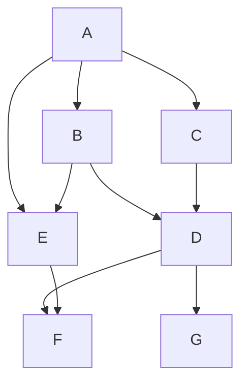

<!-- This is my very first md file -->

# Demo md file for the workshop<br>

### There will be separate sections so to present the GFM (Github Flavoured Markdown)<br><br>

#### First Section<br><br>

| Cars | Model | Engine Type | Year |
| ---- | ----- | ------ | ---- |
| BMW | X5 | Diesel | 2005 |
| Mercedes Benz | EClass | Diesel | 2019 |
| ARO | M series | Gasoline | 1959 |
| Honda | Gasoline | Civic | 2018 |
| Audi | A6 | Diesel | 2020 |

<br>

> [!NOTE]
> Note that there is a Romanian car brand as well, spot it!

<details>
<summary> Expand for the answer </summary>

#### Answer:
> ARO stands for *Auto România* and is a Romanian car brand from 1957.
</details>
<br>

> [!TIP]
> To continue, you need a bit of Bash scripting and Linux knowledge.
<br>

#### Second Section

1. ##### What does the following code snippet do?

```Bash
#!/bin/bash

while true; do
  echo "Hello, World!"
  sleep 1h
done
```

<details>
<summary> Expand for the answer </summary>

#### Answer:
> It prints the message between double quotes every hour until it is stopped.
</details>

2. ##### Was the previous code working in the background or foreground?
<details>
<summary> Expand for the answer </summary>

#### Answer:
> It was running in the foreground and you cannot use the terminal until the process terminates!
</details>

3. ##### How can you send the process to the background?
<details>
<summary> Expand for the answer </summary>

#### Answer:
> First you have to pause it with `Ctrl + z` then you have to run `bg`
</details>

4. ##### Is there a way to start the script running directly in the background?
<details>
<summary> Expand for the answer </summary>

#### Answer:
> The answer is **Yes**. You have to run the script as follows: `./myScript.sh &`
</details>
<br>

> [!IMPORTANT]
> In order to proceed further, you should have known the answer to at least 2 out of 4 questions above!
<br>

#### Third Section

##### This section is dedicated to links and images with some questions at the end

1. [This is a link to my first section](#first-section)
2. [This is a link to my second section](#second-section)
3. [What's at the end of this month?](https://as1.ftcdn.net/v2/jpg/02/88/70/42/1000_F_288704290_6zTQAmnEn4kdWxIxvQ8PAmQtT3SBtYYq.jpg)
<br>

> [!NOTE]
> This above is an image from the web and if the image is removed, then it won t show up in the repo as well when clicked
<br>

4. <br>
<br>

> [!NOTE]
> This above is an image from my fork so it will be here until I delete it locally.
<br>

5. [BE CURIOUS](https://www.lua.org/)
<br>

> [!NOTE]
> This above is an external link. See where it leads you.
<br>

> [!WARNING]
> It s safe! All external links above use `https` protocol
<br>

##### Questions:

- ##### What is the md format for images?
<details>
<summary> Expand for the answer </summary>

#### Answer:
> 
</details>
<br>

- ##### What is the md format for links?
<details>
<summary> Expand for the answer </summary>

#### Answer:
> [alt text](external-link)
</details>
<br>

- ##### What are the 2 major link types in an md file?
<details>
<summary> Expand for the answer </summary>

#### Answer:
> Internal and external
</details>
<br>

- ##### What happens if an external link whose image was deleted was included in an md file?
<details>
<summary> Expand for the answer </summary>

#### Answer:
> The image won t be available anymore.
</details>
<br>

#### Forth Section

##### This section is for formatting code snippets

1. ##### What programming language is this below?

```ruby
array = [1, 2, 3, 4, 5]

element_count = array.size

puts "Number of elements in the array: #{element_count}"
```

2. ##### What about this one?
```python
string_array = ["sky", "hello", "world", "by", "python", "fly"]

def contains_vowel(s):
    return any(char in 'aeiou' for char in s)

vowel_strings = [s for s in string_array if contains_vowel(s)]

print("Strings containing vowels:", vowel_strings)
```

3. ##### Do you know this one?
```java
public class Singleton {
    private static Singleton instance;
    private Singleton() {}

    public static Singleton getInstance() {
        if (instance == null) {
            instance = new Singleton();
        }
        return instance;
    }

    public void showMessage() {
        System.out.println("Hello from the Singleton instance!");
    }
    
    public static void main(String[] args) {
        Singleton singleton = Singleton.getInstance();
        singleton.showMessage();
    }
}
```
<details>
<summary> Expand for the answer </summary>

#### Answer:
> The answers are: Ruby, Python, Java in this order.
</details>
<br>

#### Fifth Section

##### What is your favourite emoji?
##### Some of the most popular emojis are listed below: 
:laughing: :smiley: :wink: :star_struck: :hugs:

##### Emojis palette is more diversed than that
:point_right: :lungs: :facepalm: :sassy_woman: :heart_on_fire: :tophat: :gem:

##### And there are a lot more, feel free to check them out at: [Emoji Cheat Sheet](https://github.com/ikatyang/emoji-cheat-sheet/blob/master/README.md#objects)

#### Sixth Section

##### This section is intended to create diagrams

- This is a map with the source code from: [GeoJSON](https://docs.github.com/en/get-started/writing-on-github/working-with-advanced-formatting/creating-diagrams#using-geojson)

```geojson
{
  "type": "FeatureCollection",
  "features": [
    {
      "type": "Feature",
      "id": 1,
      "properties": {
        "ID": 0
      },
      "geometry": {
        "type": "Polygon",
        "coordinates": [
          [
              [-90,35],
              [-90,30],
              [-85,30],
              [-85,35],
              [-90,35]
          ]
        ]
      }
    }
  ]
}
```

- This is an example using [STL 3D Models](https://docs.github.com/en/get-started/writing-on-github/working-with-advanced-formatting/creating-diagrams#creating-stl-3d-models)

```stl
solid cube_corner
  facet normal 0.0 -1.0 0.0
    outer loop
      vertex 0.0 0.0 0.0
      vertex 1.0 0.0 0.0
      vertex 0.0 0.0 1.0
    endloop
  endfacet
  facet normal 0.0 0.0 -1.0
    outer loop
      vertex 0.0 0.0 0.0
      vertex 0.0 1.0 0.0
      vertex 1.0 0.0 0.0
    endloop
  endfacet
  facet normal -1.0 0.0 0.0
    outer loop
      vertex 0.0 0.0 0.0
      vertex 0.0 0.0 1.0
      vertex 0.0 1.0 0.0
    endloop
  endfacet
  facet normal 0.577 0.577 0.577
    outer loop
      vertex 1.0 0.0 0.0
      vertex 0.0 1.0 0.0
      vertex 0.0 0.0 1.0
    endloop
  endfacet
endsolid
```

- This is the simplest diagram so far



